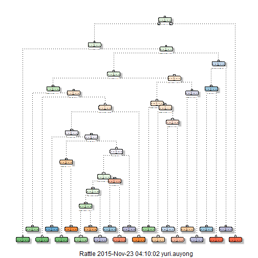

## Background
Using devices such as Jawbone Up, Nike FuelBand, and Fitbit it is now possible to collect a large amount of data about personal activity relatively inexpensively. These type of devices are part of the quantified self movement - a group of enthusiasts who take measurements about themselves regularly to improve their health, to find patterns in their behavior, or because they are tech geeks. One thing that people regularly do is quantify how much of a particular activity they do, but they rarely quantify how well they do it. In this project, the goal is to use data from accelerometers on the belt, forearm, arm, and dumbell of 6 participants. They were asked to perform barbell lifts correctly and incorrectly in 5 different ways. More information is available from the website here: http://groupware.les.inf.puc-rio.br/har. 

## Objective

The goal of this assignment is to predict the manner in which the participants of the project did the exercise. This is the "classe" variable in the training set. This report will describe how the model is built, cross validation used, what the expected out of sample error is, and the choices made in the analysis. The chosen model will also be used to predict 20 different test cases. 

## Data
The training data for this project are available here: 

https://d396qusza40orc.cloudfront.net/predmachlearn/pml-training.csv

The test data are available here: 

https://d396qusza40orc.cloudfront.net/predmachlearn/pml-testing.csv

The data for this project come from this source: http://groupware.les.inf.puc-rio.br/har.

From the "Weight Lifting Exercise Dataset" section in the source website, six young health participants were asked to perform one set of 10 repetitions of the Unilateral Dumbbell Biceps Curl in five different fashions:

- exactly according to the specification (Class A)
- throwing the elbows to the front (Class B)
- lifting the dumbbell only halfway (Class C)
- lowering the dumbbell only halfway (Class D)
- throwing the hips to the front (Class E)

Class A corresponds to the specified execution of the exercise, while the other 4 classes correspond to common mistakes. Participants were supervised by an experienced weight lifter to make sure the execution complied to the manner they were supposed to simulate. The exercises were performed by six male participants aged between 20-28 years, with little weight lifting experience. 

## Initialization


```r
library(knitr)
library(caret)
```

```
## Warning: package 'caret' was built under R version 3.2.2
```

```
## Loading required package: lattice
## Loading required package: ggplot2
```

```r
library(rpart)
library(rpart.plot)
```

```
## Warning: package 'rpart.plot' was built under R version 3.2.2
```

```r
library(RColorBrewer)
library(rattle)
library(corrplot)
```

```
## Warning: package 'corrplot' was built under R version 3.2.2
```

```r
#set options
opts_chunk$set(echo=TRUE,
               cache=TRUE)
set.seed(212121)
```

## Download and load data
Download training and testing if it doesn't exist in current directory and load data.


```r
if(!file.exists("pml-training.csv")) {
  download.file("https://d396qusza40orc.cloudfront.net/predmachlearn/pml-training.csv",
                    destfile="./pml-training.csv", method="curl")
}
if(!file.exists("pml-testing.csv")) {
  download.file("https://d396qusza40orc.cloudfront.net/predmachlearn/pml-testing.csv",
                    destfile="./pml-testing.csv", method="curl")
}
training <- read.csv("pml-training.csv", na.strings=c("NA","#DIV/0!",""))
testing <- read.csv("pml-testing.csv", na.strings=c("NA","#DIV/0!",""))
```

## Data cleaning
Dimension of training data before cleaning is as follow:


```r
dim(training)
```

```
## [1] 19622   160
```

Irrelevant variables to data analysis (namely: X(id num), user_name and names with timestamp or windows) and variables with more than 60% of NA or empty values are removed from the dataset during the cleaning process.


```r
# method to remove header and trailing space of strings
rm_htspc <- function(df) {
  if(!is.data.frame(df)) stop("rm_htspc function only accepts data.frame arg.")
  #remove header and trailing spaces for char and factor columns in data.frames
  for(col in names(df)) {
    colWasFactor <- class(df[, col]) == "factor"
    if (class(df[, col]) == "character" | colWasFactor) {
      df[, col] <- sub("^\\s+", "", df[, col])
      df[, col] <- sub("\\s+$", "", df[, col])
      if(colWasFactor) df[, col] <- as.factor(df[, col])
    }
  }
  
  df
}

training <- rm_htspc(training)
# Empty string values are replaced by NA
training[training == ""] <- NA
# remove columns that have 60% or more values == NA
training <- training[,colSums(is.na(training))<nrow(training)*0.6]
#remove columns irrelevant to our analysis: X(id num), user_name and names with timestamp or windows.
training <- training[, -c(1, 2)]
training <- training[, !grepl("timestamp|window", names(training))]
```

Near zero covariates are removed from the training data using `nearZeroVar` function.


```r
# removing zero covariates
nzv <- nearZeroVar(training, saveMetrics=T)
training <- training[, !nzv$nzv]
```

Clean testing dataset so that only variables such as in the training dataset is retained.


```r
# retain columns in testing dataset based on cleaned training dataset
testing <- testing[, names(testing) %in% names(training)[!grepl("classe", names(training))]]
```

The clean training data is then split to 60% train data(`train_s`) and 40% test data(`test_s`).


```r
#split training to training_s and testing_s
train_idx <- createDataPartition(y = training$classe, p = 0.6, list = FALSE)
train_s <- training[train_idx,]
test_s <- training[-train_idx,]
```


## Exploratory Analysis
The dimension of the `train_s` data after cleaning is as follow:


```r
dim(train_s)
```

```
## [1] 11776    53
```

More exploratory analysis is done by looking at the summary and correlation plot of the `train_s`:


```r
summary(train_s)
```

```
##    roll_belt        pitch_belt           yaw_belt       total_accel_belt
##  Min.   :-28.80   Min.   :-54.90000   Min.   :-180.00   Min.   : 0.00   
##  1st Qu.:  1.10   1st Qu.:  1.46000   1st Qu.: -88.20   1st Qu.: 3.00   
##  Median :113.00   Median :  5.23000   Median : -13.20   Median :17.00   
##  Mean   : 64.31   Mean   :  0.02329   Mean   : -10.49   Mean   :11.29   
##  3rd Qu.:123.00   3rd Qu.: 14.50000   3rd Qu.:  14.40   3rd Qu.:18.00   
##  Max.   :162.00   Max.   : 60.30000   Max.   : 179.00   Max.   :28.00   
##   gyros_belt_x        gyros_belt_y       gyros_belt_z    
##  Min.   :-1.040000   Min.   :-0.53000   Min.   :-1.3500  
##  1st Qu.:-0.030000   1st Qu.: 0.00000   1st Qu.:-0.2000  
##  Median : 0.030000   Median : 0.02000   Median :-0.1000  
##  Mean   :-0.003778   Mean   : 0.03996   Mean   :-0.1286  
##  3rd Qu.: 0.110000   3rd Qu.: 0.11000   3rd Qu.: 0.0000  
##  Max.   : 2.200000   Max.   : 0.64000   Max.   : 1.6200  
##   accel_belt_x      accel_belt_y     accel_belt_z     magnet_belt_x   
##  Min.   :-83.000   Min.   :-69.00   Min.   :-269.00   Min.   :-52.00  
##  1st Qu.:-21.000   1st Qu.:  3.00   1st Qu.:-162.00   1st Qu.:  9.00  
##  Median :-14.000   Median : 34.00   Median :-152.00   Median : 35.00  
##  Mean   : -5.226   Mean   : 30.05   Mean   : -72.41   Mean   : 56.31  
##  3rd Qu.: -4.000   3rd Qu.: 61.00   3rd Qu.:  28.00   3rd Qu.: 61.00  
##  Max.   : 78.000   Max.   :150.00   Max.   : 105.00   Max.   :481.00  
##  magnet_belt_y   magnet_belt_z       roll_arm         pitch_arm      
##  Min.   :359.0   Min.   :-623.0   Min.   :-180.00   Min.   :-87.900  
##  1st Qu.:581.0   1st Qu.:-375.0   1st Qu.: -32.30   1st Qu.:-25.100  
##  Median :601.0   Median :-320.0   Median :   0.00   Median :  0.000  
##  Mean   :593.6   Mean   :-345.8   Mean   :  17.31   Mean   : -4.122  
##  3rd Qu.:610.0   3rd Qu.:-306.0   3rd Qu.:  76.80   3rd Qu.: 11.700  
##  Max.   :673.0   Max.   : 289.0   Max.   : 180.00   Max.   : 88.500  
##     yaw_arm          total_accel_arm  gyros_arm_x        gyros_arm_y     
##  Min.   :-180.0000   Min.   : 1.0    Min.   :-6.36000   Min.   :-3.4400  
##  1st Qu.: -43.1000   1st Qu.:17.0    1st Qu.:-1.30000   1st Qu.:-0.8000  
##  Median :   0.0000   Median :27.0    Median : 0.08000   Median :-0.2400  
##  Mean   :  -0.3042   Mean   :25.6    Mean   : 0.06434   Mean   :-0.2632  
##  3rd Qu.:  47.3250   3rd Qu.:33.0    3rd Qu.: 1.59000   3rd Qu.: 0.1400  
##  Max.   : 180.0000   Max.   :65.0    Max.   : 4.87000   Max.   : 2.8400  
##   gyros_arm_z       accel_arm_x       accel_arm_y       accel_arm_z     
##  Min.   :-2.2800   Min.   :-404.00   Min.   :-318.00   Min.   :-613.00  
##  1st Qu.:-0.0700   1st Qu.:-244.00   1st Qu.: -54.00   1st Qu.:-142.00  
##  Median : 0.2300   Median : -49.00   Median :  14.00   Median : -46.00  
##  Mean   : 0.2709   Mean   : -62.77   Mean   :  33.24   Mean   : -71.28  
##  3rd Qu.: 0.7200   3rd Qu.:  81.00   3rd Qu.: 141.00   3rd Qu.:  22.00  
##  Max.   : 2.9500   Max.   : 437.00   Max.   : 303.00   Max.   : 292.00  
##   magnet_arm_x     magnet_arm_y      magnet_arm_z    roll_dumbbell    
##  Min.   :-584.0   Min.   :-386.00   Min.   :-597.0   Min.   :-152.83  
##  1st Qu.:-302.0   1st Qu.:  -5.25   1st Qu.: 137.0   1st Qu.: -16.49  
##  Median : 272.5   Median : 206.00   Median : 448.0   Median :  48.42  
##  Mean   : 186.9   Mean   : 158.45   Mean   : 308.5   Mean   :  24.34  
##  3rd Qu.: 635.0   3rd Qu.: 323.00   3rd Qu.: 546.0   3rd Qu.:  67.64  
##  Max.   : 780.0   Max.   : 583.00   Max.   : 694.0   Max.   : 153.55  
##  pitch_dumbbell     yaw_dumbbell       total_accel_dumbbell
##  Min.   :-148.50   Min.   :-150.8712   Min.   : 0.00       
##  1st Qu.: -40.93   1st Qu.: -77.9407   1st Qu.: 4.00       
##  Median : -21.15   Median :  -6.4969   Median :10.00       
##  Mean   : -10.79   Mean   :   0.5531   Mean   :13.76       
##  3rd Qu.:  17.38   3rd Qu.:  78.4774   3rd Qu.:20.00       
##  Max.   : 149.40   Max.   : 154.5161   Max.   :58.00       
##  gyros_dumbbell_x   gyros_dumbbell_y   gyros_dumbbell_z accel_dumbbell_x 
##  Min.   :-204.000   Min.   :-2.10000   Min.   : -2.30   Min.   :-419.00  
##  1st Qu.:  -0.020   1st Qu.:-0.14000   1st Qu.: -0.31   1st Qu.: -50.00  
##  Median :   0.140   Median : 0.03000   Median : -0.13   Median :  -9.00  
##  Mean   :   0.157   Mean   : 0.04849   Mean   : -0.12   Mean   : -28.65  
##  3rd Qu.:   0.350   3rd Qu.: 0.21000   3rd Qu.:  0.03   3rd Qu.:  11.00  
##  Max.   :   2.200   Max.   :52.00000   Max.   :317.00   Max.   : 235.00  
##  accel_dumbbell_y  accel_dumbbell_z  magnet_dumbbell_x magnet_dumbbell_y
##  Min.   :-182.00   Min.   :-284.00   Min.   :-639.0    Min.   :-741.0   
##  1st Qu.:  -8.00   1st Qu.:-142.00   1st Qu.:-535.0    1st Qu.: 232.0   
##  Median :  44.00   Median :  -2.00   Median :-479.0    Median : 311.0   
##  Mean   :  53.25   Mean   : -39.12   Mean   :-330.2    Mean   : 223.9   
##  3rd Qu.: 112.00   3rd Qu.:  37.00   3rd Qu.:-306.0    3rd Qu.: 390.0   
##  Max.   : 315.00   Max.   : 318.00   Max.   : 584.0    Max.   : 633.0   
##  magnet_dumbbell_z  roll_forearm      pitch_forearm     yaw_forearm     
##  Min.   :-250.00   Min.   :-180.000   Min.   :-72.50   Min.   :-180.00  
##  1st Qu.: -44.00   1st Qu.:  -2.092   1st Qu.:  0.00   1st Qu.: -68.60  
##  Median :  15.00   Median :  19.000   Median :  8.87   Median :   0.00  
##  Mean   :  47.42   Mean   :  32.712   Mean   : 10.41   Mean   :  18.73  
##  3rd Qu.:  98.00   3rd Qu.: 140.000   3rd Qu.: 27.70   3rd Qu.: 109.00  
##  Max.   : 452.00   Max.   : 180.000   Max.   : 89.80   Max.   : 180.00  
##  total_accel_forearm gyros_forearm_x    gyros_forearm_y   
##  Min.   :  0.00      Min.   :-22.0000   Min.   : -7.0200  
##  1st Qu.: 29.00      1st Qu.: -0.2200   1st Qu.: -1.4600  
##  Median : 36.00      Median :  0.0500   Median :  0.0300  
##  Mean   : 34.77      Mean   :  0.1575   Mean   :  0.1059  
##  3rd Qu.: 41.00      3rd Qu.:  0.5600   3rd Qu.:  1.6500  
##  Max.   :108.00      Max.   :  3.9700   Max.   :311.0000  
##  gyros_forearm_z    accel_forearm_x  accel_forearm_y  accel_forearm_z  
##  Min.   : -8.0900   Min.   :-496.0   Min.   :-632.0   Min.   :-446.00  
##  1st Qu.: -0.1600   1st Qu.:-178.0   1st Qu.:  57.0   1st Qu.:-181.00  
##  Median :  0.0800   Median : -56.0   Median : 202.0   Median : -37.00  
##  Mean   :  0.1639   Mean   : -60.7   Mean   : 164.9   Mean   : -53.87  
##  3rd Qu.:  0.4900   3rd Qu.:  77.0   3rd Qu.: 315.0   3rd Qu.:  27.00  
##  Max.   :231.0000   Max.   : 389.0   Max.   : 923.0   Max.   : 285.00  
##  magnet_forearm_x  magnet_forearm_y magnet_forearm_z classe  
##  Min.   :-1280.0   Min.   :-896.0   Min.   :-973.0   A:3348  
##  1st Qu.: -615.0   1st Qu.:   7.0   1st Qu.: 185.0   B:2279  
##  Median : -376.0   Median : 593.0   Median : 511.0   C:2054  
##  Mean   : -310.1   Mean   : 382.3   Mean   : 392.6   D:1930  
##  3rd Qu.:  -71.0   3rd Qu.: 738.0   3rd Qu.: 654.0   E:2165  
##  Max.   :  672.0   Max.   :1480.0   Max.   :1080.0
```

```r
corrplot(cor(train_s[, !grepl("classe", names(train_s))]), method="color")
```

 

## Data Modeling

### Prediction with Decision Tree
Next, we attempt prediction with decision tree by doing model fit using `rpart`, then view the prediction results on the test data `test_s`.


```r
modFit_rpart <- rpart(classe ~ ., data=train_s, method="class")
pred_rpart <- predict(modFit_rpart, test_s, type="class")
rpart_rs <- confusionMatrix(test_s$classe, pred_rpart)
rpart_rs
```

```
## Confusion Matrix and Statistics
## 
##           Reference
## Prediction    A    B    C    D    E
##          A 2013   60   57   84   18
##          B  326  848  193   83   68
##          C   26  134 1064   88   56
##          D  125   52  115  886  108
##          E   46  107  117  100 1072
## 
## Overall Statistics
##                                           
##                Accuracy : 0.7498          
##                  95% CI : (0.7401, 0.7594)
##     No Information Rate : 0.3232          
##     P-Value [Acc > NIR] : < 2.2e-16       
##                                           
##                   Kappa : 0.6822          
##  Mcnemar's Test P-Value : < 2.2e-16       
## 
## Statistics by Class:
## 
##                      Class: A Class: B Class: C Class: D Class: E
## Sensitivity            0.7938   0.7061   0.6882   0.7139   0.8109
## Specificity            0.9588   0.8992   0.9517   0.9394   0.9433
## Pos Pred Value         0.9019   0.5586   0.7778   0.6890   0.7434
## Neg Pred Value         0.9068   0.9442   0.9256   0.9459   0.9610
## Prevalence             0.3232   0.1531   0.1970   0.1582   0.1685
## Detection Rate         0.2566   0.1081   0.1356   0.1129   0.1366
## Detection Prevalence   0.2845   0.1935   0.1744   0.1639   0.1838
## Balanced Accuracy      0.8763   0.8026   0.8200   0.8267   0.8771
```


```r
rpart_rs$overall
```

```
##       Accuracy          Kappa  AccuracyLower  AccuracyUpper   AccuracyNull 
##   7.498088e-01   6.821710e-01   7.400696e-01   7.593621e-01   3.232220e-01 
## AccuracyPValue  McnemarPValue 
##   0.000000e+00   1.406466e-51
```

The estimated accuracy from `rpart` model fit is 74.98% and the expected out-of-sample error is 25.02%.

### Prediction with Random Forest

Next, we attempt prediction with Random Forest by doing model fit using caret train `rf` method setting k-fold cross validation to 5 and `ntree` equal to 300, then view the prediction results on the test data `test_s`.


```r
modFit_rf <- train(classe ~ ., data=train_s, method="rf", trControl=trainControl(method="cv", 5), allowParallel=T, ntree=300)
```

```
## Loading required package: randomForest
## randomForest 4.6-12
## Type rfNews() to see new features/changes/bug fixes.
```

```r
pred_rf <- predict(modFit_rf, test_s)
rf_rs <- confusionMatrix(test_s$classe, pred_rf)
rf_rs
```

```
## Confusion Matrix and Statistics
## 
##           Reference
## Prediction    A    B    C    D    E
##          A 2231    1    0    0    0
##          B   16 1502    0    0    0
##          C    0    8 1359    1    0
##          D    0    0   17 1269    0
##          E    0    0    0    4 1438
## 
## Overall Statistics
##                                          
##                Accuracy : 0.994          
##                  95% CI : (0.992, 0.9956)
##     No Information Rate : 0.2864         
##     P-Value [Acc > NIR] : < 2.2e-16      
##                                          
##                   Kappa : 0.9924         
##  Mcnemar's Test P-Value : NA             
## 
## Statistics by Class:
## 
##                      Class: A Class: B Class: C Class: D Class: E
## Sensitivity            0.9929   0.9940   0.9876   0.9961   1.0000
## Specificity            0.9998   0.9975   0.9986   0.9974   0.9994
## Pos Pred Value         0.9996   0.9895   0.9934   0.9868   0.9972
## Neg Pred Value         0.9971   0.9986   0.9974   0.9992   1.0000
## Prevalence             0.2864   0.1926   0.1754   0.1624   0.1833
## Detection Rate         0.2843   0.1914   0.1732   0.1617   0.1833
## Detection Prevalence   0.2845   0.1935   0.1744   0.1639   0.1838
## Balanced Accuracy      0.9964   0.9958   0.9931   0.9967   0.9997
```


```r
rf_rs$overall
```

```
##       Accuracy          Kappa  AccuracyLower  AccuracyUpper   AccuracyNull 
##      0.9940097      0.9924211      0.9920420      0.9955953      0.2863880 
## AccuracyPValue  McnemarPValue 
##      0.0000000            NaN
```

The estimated accuracy from the `rf` model fit is 99.4% and the expected out-of-sample error is 0.6%.

## Results
Finally, as the Random Forest model fit gives a better accuracy than the `rpart` model fit, it is used to predict the class action from the testing dataset variables loaded in the beginning of this report: 


```r
predict_testing_rf <- predict(modFit_rf, testing)
predict_testing_rf
```

```
##  [1] B A B A A E D B A A B C B A E E A B B B
## Levels: A B C D E
```


## Appendix

### Decision Tree rpart plot


```r
fancyRpartPlot(modFit_rpart)
```

```
## Warning: labs do not fit even at cex 0.15, there may be some overplotting
```

 
